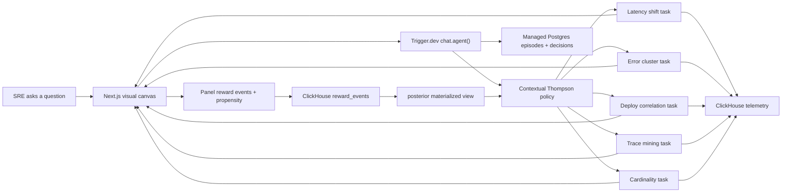

# Trinetra

**The third eye for your telemetry.**

Trinetra is an incident-investigation chat agent that answers with a living visual canvas - and learns which visuals answer you best while it is answering.

Ask “why was Tuesday slow?” and Trinetra fans out durable probes for latency shifts, error clusters, deploy correlation, trace mining, and cardinality. Each probe streams a finished visual panel into the root chat session. Clicking or expanding early evidence writes a reward event with the decision propensity; that reward can shift the contextual Thompson policy and change which panel arrives next.

Built for the ClickHouse x Trigger.dev Virtual Summer Hackathon 2026.

## What is implemented

- Polished responsive incident canvas with progressive panels, root-cause confirmation, full-screen drill-downs, and a live investigation rail
- Deterministic credential-free demo runtime for immediate judging and video capture
- Durable `chat.agent()` implementation with Trigger.dev probe subtasks and root-streamed `data-panel` parts
- Five substantive ClickHouse probes: latency shift, error clustering, deploy correlation, trace mining, and cardinality scan
- Official ClickHouse MCP tool layer for live schema discovery and read-only SQL
- Contextual Thompson sampling with logged action propensities
- Mid-episode reward feedback that promotes trace mining after interaction with concentrated error evidence
- ClickHouse materialized view as the policy’s aggregate “training step”
- ClickHouse-managed Postgres schema for live episodes, decisions, and annotations
- Disclosed simulated-SRE replay schedule for bootstrapping the learning curve
- Seeded OTel-shaped incident generator with a known connection-pool regression
- Learning dashboard, durable task DAG, exploratory miss, and jackpot root-cause reward

## Architecture



ClickHouse is the learner: conjugate Bayesian updates require only sufficient statistics, so the update path is an `AggregatingMergeTree` materialized view over `reward_events`. The LLM remains frozen. This is contextual-bandit reinforcement learning, not fine-tuning or RLHF.

## Run locally

Requirements: Node.js 20+ and pnpm.

```bash
pnpm install
pnpm dev
```

Open [http://localhost:3000](http://localhost:3000). No credentials are required; the main canvas uses the deterministic local stream.

The first result fan-out appears progressively. Open the error-cluster panel to see its reward shift the posterior and promote trace mining into the next slot. Confirm the root cause to log the jackpot reward. Use the header to switch to the task DAG and learning dashboard.

## Run the real cloud path

Copy `.env.example` to `.env.local` and configure:

- `TRIGGER_SECRET_KEY` and `TRIGGER_PROJECT_REF`
- `OPENAI_API_KEY` and the frozen `TRINETRA_MODEL`
- `CLICKHOUSE_URL`, `CLICKHOUSE_USER`, `CLICKHOUSE_PASSWORD`, and `CLICKHOUSE_DATABASE`
- `POSTGRES_URL` for ClickHouse-managed Postgres

Apply the policy schema plus one telemetry ingest path — the synthetic demo
seed and the real OpenTelemetry Demo are mutually exclusive:

```bash
# Learning/policy tables (both paths)
clickhouse-client --multiquery < db/clickhouse/001_schema.sql
psql "$POSTGRES_URL" -f db/postgres/001_schema.sql

# Path A — synthetic 5-service demo seed
clickhouse-client --multiquery < db/clickhouse/004_demo_telemetry.sql
pnpm seed
```

Start the Trigger.dev worker and Next.js:

```bash
pnpm trigger:dev
pnpm dev
```

Open [http://localhost:3000/live](http://localhost:3000/live) for the direct `useChat` + `useTriggerChatTransport` surface. The production canvas and the live agent share the same typed `PanelData` contract.

### Path B — real OpenTelemetry Demo telemetry

Instead of the synthetic seed, ingest live telemetry from the ~20-microservice
[OpenTelemetry Demo](https://github.com/open-telemetry/opentelemetry-demo). The
demo's OTel Collector fans logs, metrics, and traces into ClickHouse; the
probes read them unchanged through compatibility views.

```bash
git clone https://github.com/open-telemetry/opentelemetry-demo.git
cd opentelemetry-demo
cp /path/to/trinetra/datagen/otel-demo/otelcol-clickhouse.yaml .
docker compose \
  -f docker-compose.yml \
  -f /path/to/trinetra/datagen/otel-demo/compose.clickhouse.yaml \
  up
```

The collector's ClickHouse exporter lazily creates `otel_logs`, `otel_traces`,
and `otel_metrics_*` on first flush. Then expose them under the probe-facing
`logs`/`metrics`/`spans` names and load the failure-flag ground truth:

```bash
clickhouse-client --multiquery < db/clickhouse/005_otel_views.sql
clickhouse-client --multiquery < db/clickhouse/006_otel_incident_labels.sql
```

Do not apply `004_demo_telemetry.sql` on the same instance — its real tables
collide with the view names. Manufacture incidents from the demo's flagd UI
(`paymentServiceFailure`, `cartServiceFailure`, `adServiceHighCpu`, …); the
matching labels in `006_otel_incident_labels.sql` are the disclosed root cause
the replayer bootstraps from.

The Trigger.dev implementation follows the current managed-agent and subtask streaming patterns:

- `trigger/agent.ts` defines the durable root `chat.agent()`.
- `lib/clickhouse/mcp.ts` connects the agent to two MCP tool surfaces. The
  ClickHouse MCP server (`uvx mcp-clickhouse` over stdio locally, or
  `CLICKHOUSE_MCP_URL` for a hosted endpoint) provides raw read-only SQL for the
  long tail. The optional ClickStack (HyperDX) MCP server
  (`CLICKSTACK_MCP_URL` or `CLICKSTACK_MCP_COMMAND`) adds higher-level
  investigation primitives over logs, metrics, and traces; it is wired in only
  when configured, and the agent is told to prefer it and fall back to raw SQL.
- `trigger/probes/*.ts` are typed `schemaTask` probe subtasks.
- Each subtask uses `chat.stream.writer({ target: "root" })` to stream custom visual data parts.
- `trigger/replayer.ts` runs the disclosed bootstrap replay every ten minutes.

## Policy and reward design

State is a coarse query-intent bucket. Actions are the next probe to run. Per-panel rewards are:

| Signal | Value |
| --- | ---: |
| Impression | 0.00 |
| Dwell | shaped |
| Click | 0.62 |
| Expand | 0.78 |
| Drill-down | 0.90 |
| Confirm root cause | 1.00 |

Every policy decision records the sampled score and selection propensity in Postgres. Every interaction writes its reward and propensity to ClickHouse, leaving the system ready for inverse-propensity off-policy evaluation.

## Repository map

```text
app/                  Next.js routes, local stream, rewards, Trigger actions
components/           Incident canvas, charts, learning and live agent views
trigger/agent.ts      Durable chat.agent() turn loop
trigger/probes/       ClickHouse probe subtasks and streamed visual parts
trigger/replayer.ts   Disclosed simulated-SRE bootstrap cron
lib/policy/           Context bucketing and Thompson sampling
lib/clickhouse/       ClickHouse client and reward/posterior access
lib/postgres/         Episode and policy-decision state
db/clickhouse/        OTel telemetry, reward stream, posterior MV
db/postgres/          OLTP episode, decision, annotation schema
datagen/              Seeded known-root-cause incident generator
tests/                Policy and context unit tests
```

## Verification

```bash
pnpm test
pnpm lint
pnpm build
```

## Submission summary

Trinetra replaces the observability wall of text with a living incident canvas. A durable Trigger.dev chat agent classifies each question and uses a contextual Thompson policy to choose which ClickHouse probes run first. Typed subtasks query OTel-shaped logs, metrics, and traces, then stream timeline, heatmap, deploy-diff, trace-waterfall, and cardinality panels directly into the root chat response. Panel impressions, dwell, clicks, expansions, drill-downs, and root-cause confirmation become propensity-logged reward events in ClickHouse. An `AggregatingMergeTree` materialized view maintains the policy’s sufficient statistics, while ClickHouse-managed Postgres holds low-latency episode and decision state. Feedback can update the posterior mid-episode and change the next probe, making the answer visibly adapt while it is assembled. A clearly disclosed simulated-SRE replayer bootstraps labeled incidents so the learning dashboard demonstrates improvement before real traffic accumulates. The frozen LLM proposes candidates; the policy disposes. No fine-tuning or RLHF is claimed.

## License

MIT
